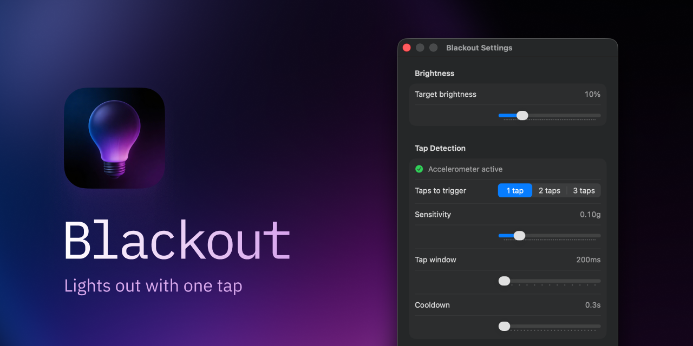

<p align="center">

</p>

<h1 align="center">Blackout</h1>

<p align="center">
Lights out with one tap.<br>
Instant screen privacy for your MacBook.
</p>

<p align="center">
v1.0.0 · macOS 14.6+ · Apple Silicon
</p>

---



Blackout uses the built-in accelerometer on Apple Silicon MacBooks to detect physical taps on the chassis. Tap to kill your screen. Tap again to bring it back.

No permissions. No dock icon. Just a lightbulb in your menu bar.

## Features

- **Physical tap detection** — 1, 2, or 3 taps (configurable)
- **Keyboard shortcut** — set any global hotkey as a backup trigger
- **Configurable brightness** — dim to 0-50% (default 10%)
- **Tunable sensitivity** — adjust g-force threshold, tap window, and cooldown
- **Launch at login** — optional auto-start
- **Zero permissions** — no accessibility, no input monitoring, no root

## Install

Download the latest DMG from [Releases](../../releases), open it, and drag Blackout to Applications.

## Settings

| Setting | Default | Range |
|---|---|---|
| Target brightness | 10% | 0-50% |
| Taps to trigger | 1 | 1-3 |
| Sensitivity | 0.10g | 0.02-0.50g |
| Tap window | 200ms | 200-800ms |
| Cooldown | 0.3s | 0.3-3.0s |

## Compatibility

- macOS 14.6+ (Sonoma)
- Apple Silicon only (M1, M2, M3, M4)
- MacBooks only (no desktop Macs)
- Built-in display only — does not work when connected to an external monitor

## Build from Source

```bash
swift build -c release
.build/release/Blackout
```

## Feedback

Found a bug or have a feature idea? [Open an issue](../../issues).

## License

[MIT](LICENSE)

---

Made by [santiagoalonso.com](https://santiagoalonso.com)
